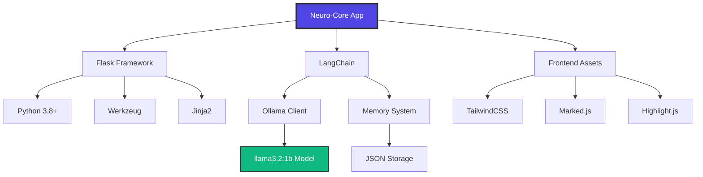

# Neuro-Core AI Assistant

A powerful, memory-enabled AI chat application built with Flask and LangChain, featuring real-time streaming responses, file processing, and persistent memory across sessions.

## 🚀 Features

### Core Capabilities
- **Real-time Streaming**: Live response generation with typing indicators
- **Memory System**: Persistent user information and conversation context
- **File Processing**: Upload and analyze PDFs, JSON, and text files
- **API Integration**: Fetch and store data from external APIs
- **Dark/Light Theme**: Automatic theme switching with persistence

### Advanced Features
- **Multi-format Support**: Images, PDFs, JSON, and text files
- **Context-aware Responses**: Uses uploaded files and API data for answers
- **Session Management**: Browser-based conversation history
- **Mobile Responsive**: Optimized for all device sizes
- **Copy Code Blocks**: One-click code copying with syntax highlighting

## 🛠️ Tech Stack

### Backend Technologies
- **Framework**: Flask 2.3+
- **Language**: Python 3.8+
- **AI Framework**: LangChain 0.1+
- **AI Model**: Ollama (llama3.2:1b)
- **Session Management**: Flask Sessions
- **File Handling**: Werkzeug
- **HTTP Client**: Requests
- **Environment**: python-dotenv

### Frontend Technologies
- **Language**: Vanilla JavaScript (ES6+)
- **CSS Framework**: TailwindCSS 3.0+
- **Markdown Rendering**: Marked.js
- **Syntax Highlighting**: Highlight.js
- **Icons**: Unicode Emojis
- **Responsive Design**: CSS Grid & Flexbox

### File Processing
- **PDF Processing**: PyPDF2
- **JSON Parsing**: Native Python JSON
- **Text Processing**: UTF-8 encoding
- **Image Support**: Multiple formats (JPEG, PNG, GIF)
- **File Upload**: HTML5 File API

### Data Storage
- **Session Storage**: Flask server-side sessions
- **File Storage**: Local filesystem
- **Memory Storage**: JSON files
- **Global Memory**: Persistent JSON storage

### Development Tools
- **Package Manager**: pip
- **Dependency Management**: requirements.txt
- **Development Server**: Flask built-in server
- **Production Server**: Gunicorn (recommended)
- **Containerization**: Docker support

### External Services
- **AI Inference**: Ollama local server
- **API Integration**: RESTful APIs
- **Font Loading**: Google Fonts (Inter)
- **CDN**: TailwindCSS, Marked.js, Highlight.js

## 📋 Prerequisites

- Python 3.8 or higher
- Ollama installed and running
- Modern web browser

## ⚡ Quick Start

### 1. Install Ollama
```bash
# macOS/Linux
curl -fsSL https://ollama.ai/install.sh | sh

# Windows
# Download from https://ollama.ai/download
```

### 2. Pull AI Model
```bash
ollama pull llama3.2:1b
```

### 3. Clone & Setup
```bash
git clone <repository-url>
cd Neuro-Core
pip install -r requirements.txt
```

### 4. Run Application
```bash
python app.py
```

Visit `http://localhost:5011`

## 📁 Project Architecture

### Directory Structure
```
Neuro-Core/
├── app/                     # Backend application
│   ├── __init__.py          # Flask app factory
│   ├── routes.py            # API endpoints & routing
│   ├── config.py            # Configuration settings
│   ├── helpers.py           # Utility functions
│   ├── langchain_client.py  # LangChain integration
│   ├── openai_client.py     # Ollama client connection
│   └── pdf_utils.py         # PDF text extraction
├── static/                  # Frontend assets
│   ├── css/
│   │   └── style.css        # Custom CSS styles
│   ├── js/
│   │   └── app.js          # Frontend JavaScript logic
│   └── uploads/            # File storage directory
├── templates/              # HTML templates
│   └── index.html          # Main chat interface
├── requirements.txt        # Python dependencies
├── app.py                 # Application entry point
├── README.md              # Project documentation
└── .env                   # Environment variables (optional)
```

### Component Architecture
```
┌─────────────────┐    ┌─────────────────┐    ┌─────────────────┐
│   Frontend      │    │    Backend      │    │   AI Engine     │
│                 │    │                 │    │                 │
│ • HTML/CSS/JS   │◄──►│ • Flask Routes  │◄──►│ • Ollama        │
│ • TailwindCSS   │    │ • LangChain     │    │ • llama3.2:1b   │
│ • Marked.js     │    │ • Memory System │    │ • Local Inference│
│ • Highlight.js  │    │ • File Handler  │    │                 │
└─────────────────┘    └─────────────────┘    └─────────────────┘
         │                       │                       │
         ▼                       ▼                       ▼
┌─────────────────┐    ┌─────────────────┐    ┌─────────────────┐
│ Browser Storage │    │ File System     │    │ Model Storage   │
│ • Sessions      │    │ • Uploads       │    │ • Model Cache   │
│ • LocalStorage  │    │ • Memory JSON   │    │ • Embeddings    │
└─────────────────┘    └─────────────────┘    └─────────────────┘
```

### Technology Dependencies


## 🔧 Configuration

### Environment Variables
```bash
FLASK_SECRET_KEY=your_secret_key_here
OLLAMA_MODEL=llama3.2:1b
```

### Model Configuration
Edit `app/config.py`:
```python
OLLAMA_MODEL = "llama3.2:1b"  # Change model here
SYSTEM_PROMPT = "Your custom prompt"
```

## 💡 Usage Guide

### Basic Chat
- Type your message and press Enter
- Responses stream in real-time
- Use Shift+Enter for new lines

### File Upload
1. Click the ➕ button
2. Select PDF, JSON, or text files
3. Ask questions about the content
4. AI uses file data for context-aware answers

### Memory Features
- **Personal Info**: "My name is John" → AI remembers
- **Teaching**: "Remember that Python is my favorite language"
- **API Data**: "Fetch data from https://api.example.com"

### API Integration
```bash
# Fetch external data
"Get data from https://jsonplaceholder.typicode.com/posts/1"

# Ask about fetched data
"What was the title of the post?"
```

## 🔌 API Documentation

### Core Endpoints
| Endpoint | Method | Description | Response Type |
|----------|--------|-------------|---------------|
| `/` | GET | Main chat interface | HTML |
| `/chat` | POST | Send message (instant) | JSON |
| `/stream` | POST | Send message (streaming) | SSE |
| `/upload` | POST | Upload files | JSON |
| `/clear` | POST | Clear chat history | JSON |

### Memory & Data
| Endpoint | Method | Description | Response Type |
|----------|--------|-------------|---------------|
| `/memory` | GET | Get stored memory | JSON |
| `/teach` | POST | Teach AI information | JSON |
| `/api-fetch` | POST | Fetch external API | JSON |
| `/files` | GET | List uploaded files | JSON |
| `/file/<name>` | GET | Get file content | JSON |

### System & Debug
| Endpoint | Method | Description | Response Type |
|----------|--------|-------------|---------------|
| `/health` | GET | System health check | JSON |
| `/config` | GET | Current configuration | JSON |
| `/debug/memory` | GET | Memory debug info | JSON |
| `/debug/files` | GET | File storage debug | JSON |
| `/debug/apis` | GET | API storage debug | JSON |

### Request/Response Examples

**Chat Message:**
```javascript
// Request
fetch('/stream', {
  method: 'POST',
  headers: { 'Content-Type': 'application/json' },
  body: JSON.stringify({
    message: "Explain machine learning",
    image_url: null
  })
});

// Response (Server-Sent Events)
data: {"delta": "Machine"}
data: {"delta": " learning"}
data: {"delta": " is..."}
data: {"done": true}
```

**File Upload:**
```javascript
// Request
const formData = new FormData();
formData.append('file', fileInput.files[0]);
fetch('/upload', { method: 'POST', body: formData });

// Response
{
  "url": "/static/uploads/document.pdf",
  "storage_result": "Successfully stored PDF content",
  "filename": "document.pdf"
}
```

**Memory Query:**
```javascript
// Request
fetch('/memory');

// Response
{
  "memory": {
    "name": "John",
    "preferences": "Python programming",
    "files": {...},
    "apis": {...}
  }
}
```

## 🎨 Customization

### Themes
- Auto-detects system preference
- Toggle with theme button
- Persists across sessions

### Styling
Modify `static/css/style.css` for custom styles:
```css
:root {
  --primary-color: #4f46e5;
  --radius: 16px;
}
```

### AI Behavior
Edit system prompt in `app/config.py`:
```python
SYSTEM_PROMPT = """
You are a helpful AI assistant with these capabilities:
- Remember user information
- Process uploaded files
- Access API data
- Provide detailed explanations
"""
```

## 🔍 Troubleshooting

### Common Issues

**Ollama not responding**
```bash
# Check if Ollama is running
ollama list

# Restart Ollama service
ollama serve
```

**File upload fails**
- Check file size (max 16MB)
- Ensure `static/uploads/` directory exists
- Verify file permissions

**Memory not persisting**
- Check `static/uploads/global_memory.json`
- Verify write permissions
- Clear browser cache

### Debug Endpoints
- `/debug/memory` - View memory state
- `/debug/files` - Check uploaded files
- `/debug/apis` - See stored API data
- `/health` - Check Ollama connection

## 🚀 Deployment

### Production Setup
```bash
# Install production server
pip install gunicorn

# Run with Gunicorn
gunicorn -w 4 -b 0.0.0.0:5011 app:app
```

### Docker Deployment
```dockerfile
FROM python:3.9-slim
WORKDIR /app
COPY requirements.txt .
RUN pip install -r requirements.txt
COPY . .
EXPOSE 5011
CMD ["python", "app.py"]
```

### Environment Variables
```bash
export FLASK_ENV=production
export FLASK_SECRET_KEY=your_production_key
export OLLAMA_HOST=http://ollama-server:11434
```

## 🤝 Contributing

1. Fork the repository
2. Create feature branch (`git checkout -b feature/amazing-feature`)
3. Commit changes (`git commit -m 'Add amazing feature'`)
4. Push to branch (`git push origin feature/amazing-feature`)
5. Open Pull Request

## 📝 License

This project is licensed under the MIT License - see the [LICENSE](LICENSE) file for details.

## 🙏 Acknowledgments

- [Ollama](https://ollama.ai/) for local AI inference
- [LangChain](https://langchain.com/) for AI framework
- [TailwindCSS](https://tailwindcss.com/) for styling
- [Flask](https://flask.palletsprojects.com/) for web framework

## 📞 Support

- **Issues**: [GitHub Issues](https://github.com/vishaldeshmukh2k6/Neuro-Core)
- **Discussions**: [GitHub Discussions](https://github.com/vishaldeshmukh2k6/Neuro-Core)
- **Email**: vishaldeshmuk143@gmail.com

---

**Made with ❤️ by [ Vishal Deshmukh ]**
